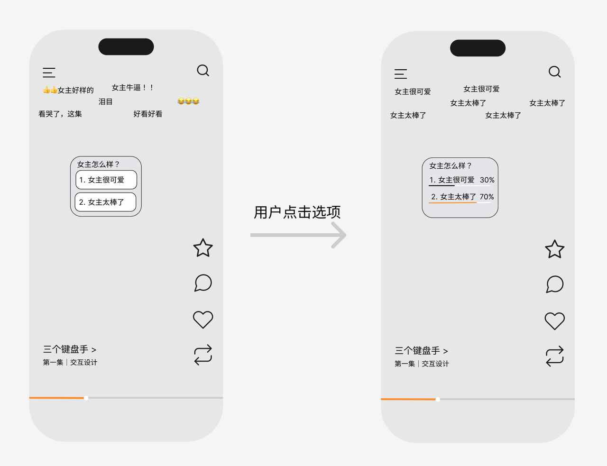

# 1. 项目背景
短剧内容正在成为移动端内容消费的重要形态。相比传统长视频，短剧具有节奏快、冲突密集、反转频繁、情绪价值强等特点。用户在观看短剧时，经常会在剧情高光瞬间产生强烈的表达欲，例如震惊、爽感、愤怒、心疼、磕到了、再看一遍等。
当前市面上的短剧平台所提供的情绪表达入口/交互方式有以下几种：
1. 以“弹幕”为表达载体： 
    1. 交互一：发弹幕
    2. 交互二：点赞弹幕
2. 以“评论”为表达载体
    1. 交互一：发评论
    2. 交互二：点赞评论

传统用户旅程：
- 表达欲出现 -> 点击发送弹幕 (进入表达入口) -> 输入内容（动作1） -> 发送（动作2） -> 私信通知点赞和回复 （表达的反馈）
- 表达欲出现 -> 点击目标弹幕 (进入表达入口) -> 点赞（动作1）
- 表达欲出现 -> 点击目标弹幕 (进入表达入口) -> 点击回复按钮 （动作1）-> 输入内容（动作2）-> 发送（动作3）-> 私信通知点赞和回复（表达的反馈）
- 表达欲出现 -> 点击评论区图标  (进入表达入口) -> 点击发送评论 （动作1）-> 输入内容 （动作2）-> 私信通知点赞和回复（表达的反馈）

用户痛点：
1. 表达摩擦大，而短剧节奏快，容易错过表达窗口。
2. 打断了用户的观看体验。
3. 反馈不足/不及时，无法获得共鸣。

# 2. 产品定位
本产品旨在希望构建一套面向短剧消费场景的「即时互动激发系统」。在短剧播放过程中，为用户提供低门槛、不中断观看的交互入口，让用户低摩擦的完成情绪表达，从而获得更好的剧情参与感与情绪体验的目的。

- 功能一，交互功能：让用户以尽可能低的心智负担完成情绪表达，并给予足够的反馈。

- 功能二，高光点识别：高效、准确地识别剧中的高光时刻，识别结果分发到其他服务。

- 功能三，用户反馈收集与策略更新：收集用户的行为（情绪表达的内容，进度条的拖拽，反复观看的段落...）反哺前两个功能。
    - 功能一是这道题的题眼
    - 功能二是基础设施
    - 功能三是系统鲁棒性，泛化性的体现

# 3. 目标用户与用户旅程
## 3.1 目标用户
主要用户为移动端短剧观看用户。
## 3.2 用户旅程
[系统检测到此处可能会引起情绪表达] -> [提供情绪表达的交互入口] -> 用户做简单交互 -> [系统给予表达反馈] -> [用户行为收集，策略更新]

用户正在手机端观看一集短剧。当剧情进入高光点，例如打脸反杀、甜蜜撒糖、冲突爆发时，系统自动提供情绪表达的交互入口。
用户无需打字，而是通过更低摩擦的方式（e.g. 点击、长按、滑动或连点）即可完成情绪表达。表达后，系统及时反馈，增强情绪体验。

# 4. 产品目标
## 4.1 MVP 目标 —— 60分
完成从「短剧高光点识别」到「客户端即时互动渲染」再到「用户反馈采集与策略更新」的完整闭环。
MVP 必须包括：
1. 高光点识别与结构化存储；
2. 客户端播放到高光点时触发互动；
3. 用户低摩擦表达情绪；
4. 系统给予表达反馈；
5. 用户行为回传后台；
6. 后台基于反馈更新高光点分数与互动策略；

## 4.2 优秀奖目标 —— 80-90分
在 MVP 的基础上做的更扎实：
1. 高光点识别的准确度和效率是多少？完成1000部剧的成本是多少？
2. 用户到底想要什么样的交互方式？想做怎么样的情绪表达？想拿到什么样的表达反馈？
3. 良好的项目文档
4. 良好的结果呈现

这些是为了证明系统具备作为真实业务基础设施继续打磨的潜力。

## 4.3 卓越奖目标 —— 90-100分
“卓越”意味着“令人印象深刻”
需要做到以下两点：

第一， **优秀的视觉呈现和汇报答辩**

第二，**在题目之外，还能想到什么**：

1. 用户除了想做“情绪表达”，是否还想做“观点表达”？例如，在女主选择男一还是男二的悬念时刻，用户想表达的不只是一种情绪（兴奋，紧张，激动），也是一种观点（选男一！ Or 选男二！）
2. 用户和短剧的交互除了用来“表达用户所感所想”，还能有什么？
    1. 〈底特律变人》QTE 的交互逻辑
    2. 短剧的广告植入
3. 高光点还能用来做什么？
    1. 快速跳转
    2. 高光剪辑

# 5. 前端和交互设计
## 5.1 方案一：弹幕投票
直接模仿 哔哩哔哩 的设计：

